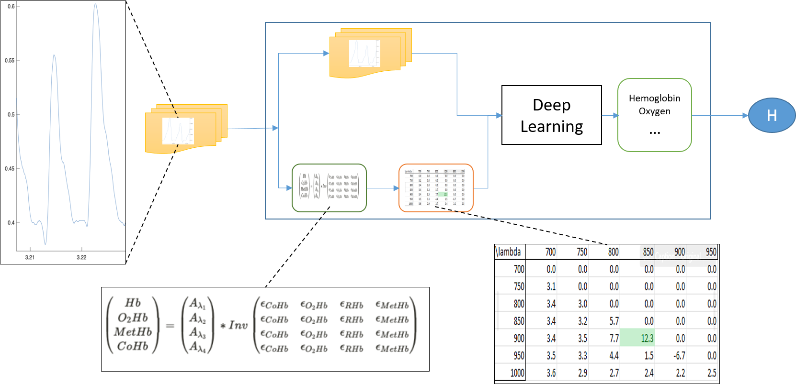

# CAWT_DeepLearning_HemoglobinLevel
In this repository we use Deep Learning techniques to improve Hemoglobin Levels measurements from optical wearable technology.

Fig. 1: Initial design of Deep Learning to perform the Hemoglobin Levels predictions.
